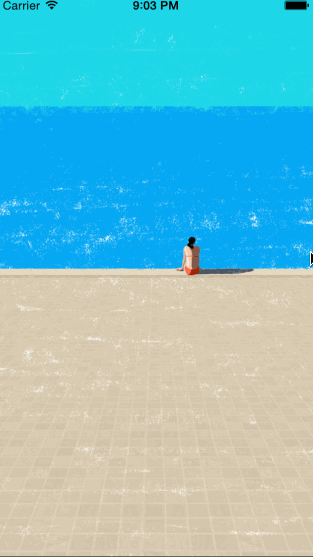

# AKLaunchWebVC H5启动页
####初衷<br />
让app启动的时候，先加载LaunchImage，随后展示动态h5启动效果，最后进入主程序

####特点<br />
1使用html5结合launchImage制作出动态的效果<br />
2容易维护<br />
3开发动画效果十分便捷<br />


 


####支持<br />
系统支持：iOS7.0及以上

熟悉html5的同学可以通过修改Guide.html，style.css达到目的效果，可通过浏览器测试动画


当前项目中的Guide.html:
```
//ad的动画效果在style.css中定义，如下
    /*
     .ad,.ad-pad{
     background: url(../guideImg/ad.png) no-repeat;
     background-size: 199px 42px;
     width: 199px;
     height: 42px;
     margin: 32px auto 0;
     -webkit-animation: scene-fade2 3s both; //即3秒后动画结束， 结束引导页
     animation: scene-fade2 3s both;
     -webkit-animation-delay: 2s;
     animation-delay: 2s;
     */
    var ad = document.querySelector('#ad');
    
    ad.addEventListener("click", function(){
                        }, false);
                        
    //当id="ad"这个元素动画结束时，启动页结束
    ad.addEventListener("webkitAnimationEnd", function(){
                        
                        
                                            //动画结束时事件
                                            console.log('finish Launch');
                                            window.location.href="finishLaunch";
                                            }, false);
                                            

```


